# Nexus Projects (Client)

A production-grade, multi-tenant Flutter client for managing complex projects with AI coordination, agentic task execution, Git integration, CI/CD, and observability.

## Vision

Nexus Projects gives teams (and individuals) a powerful environment where:

- **Clients** act as top-level tenants (full data isolation + sharing via "Clone to Client").
- **Projects** contain rich plans that drive hierarchical task generation.
- The **Project Coordinator** (the "main brain") can be talked to via **text or voice**, sees full project context, and can directly create/update tasks, propose plan changes, and generate diagrams using real multi-modal capabilities.
- Real **AEC + VAD** voice processing for natural, hands-free conversations.
- Full agentic workflows with inference servers, personas, tool calling, and live reactive updates.

## Architecture: Router + Client

Nexus Projects is two cooperating components — a server-side **Router** and this user-facing **Client**.

### Nexus Router (server)

A separate, multi-tenant gateway service (C#/.NET) that sits in front of all AI inference. It is the billing
and access-control brain of the system:

- **Authentication & tenancy** — registration, login, and API tokens, organized as a tenant chain of
  **Client → Account → Users → Tokens** with strict data isolation.
- **Subscriptions & billing** — subscription plans and add-ons backed by Stripe, with checkout and
  manage-billing flows.
- **Metering & quotas** — every routed inference request is measured against the account's entitlements for
  the current Stripe billing period. Going over quota does not hard-fail requests; instead output is paced
  (throttled) and an upgrade prompt is surfaced, so the app keeps working.
- **Inference proxy** — chat, tools, image, and audio (STT/TTS) requests are proxied through the Router to
  the underlying inference backends, so usage can be authenticated and billed centrally.

The Router is closed-source and operated by Nexus Projects; this repository contains the Client only.

### Nexus Projects Client (this repo)

The Flutter desktop/mobile application — the project workspace, the AI **Coordinator**, plans, tasks, and
agents. The Client connects to the Nexus Router for **authentication, subscription/billing, and routed
inference**. The account surface in the Client (login, register, plan catalog, usage meter, checkout) is the
front end to the Router's subscription system; it is not a standalone billing implementation and is not meant
to be repointed at any other gateway.

In short: the **Router decides who may use inference and bills for it; the Client is where the work happens**
and is the customer-facing front end to that subscription system.

## Key Features (Current State)

- **Strict multi-tenancy** — Client selector scopes everything (projects, tasks, inference servers, personas, activity, etc.).
- **Project Coordinator** (the signature feature):
  - Rich text chat with live project context.
  - Voice mode with automatic end-of-speech detection (real Silero VAD).
  - Proper OS-level AEC and noise suppression via `audio_session` + platform voice communication modes.
  - The AI can call tools to **create tasks**, **update status**, **propose plan adjustments**, and **generate diagrams** — changes persist immediately and reflect in the UI.
- **One class per file** architecture with clean separation (`infrastructure/models/database` vs `ui`, `features/...`).
- Reactive Drift + Riverpod throughout.
- Supports streaming, tools, image generation, and audio (STT/TTS).
- 3-pane resizable shell with proper default proportions.

## Screenshots

#### Project setup, driven by an interview
The Coordinator interviews you about the project with short multiple-choice questions and proposes tags onto the board as you talk — turning a conversation into a structured stack (Industries, Platforms, Objectives, Features, Languages, Frameworks, Libraries). The left rail scopes everything by **Client → Project**.

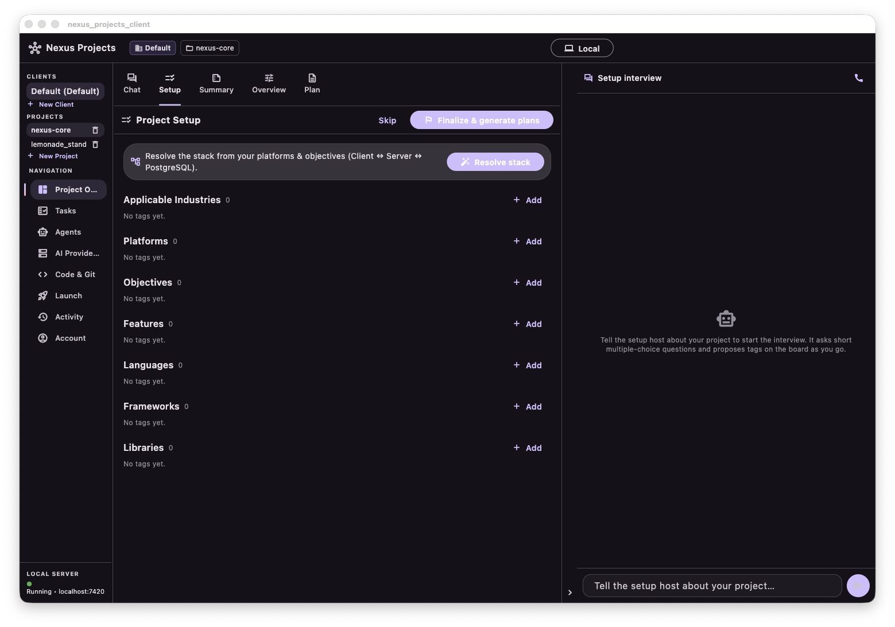

#### The Coordinator interview — text or voice
Answer by typing, or go hands-free. Real Silero VAD with end-of-speech detection and OS-level echo cancellation lets you talk to the Coordinator naturally while it fills in the board live.

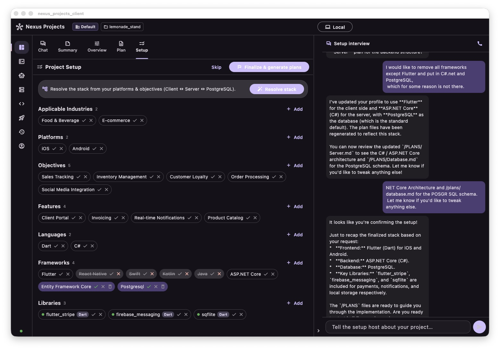
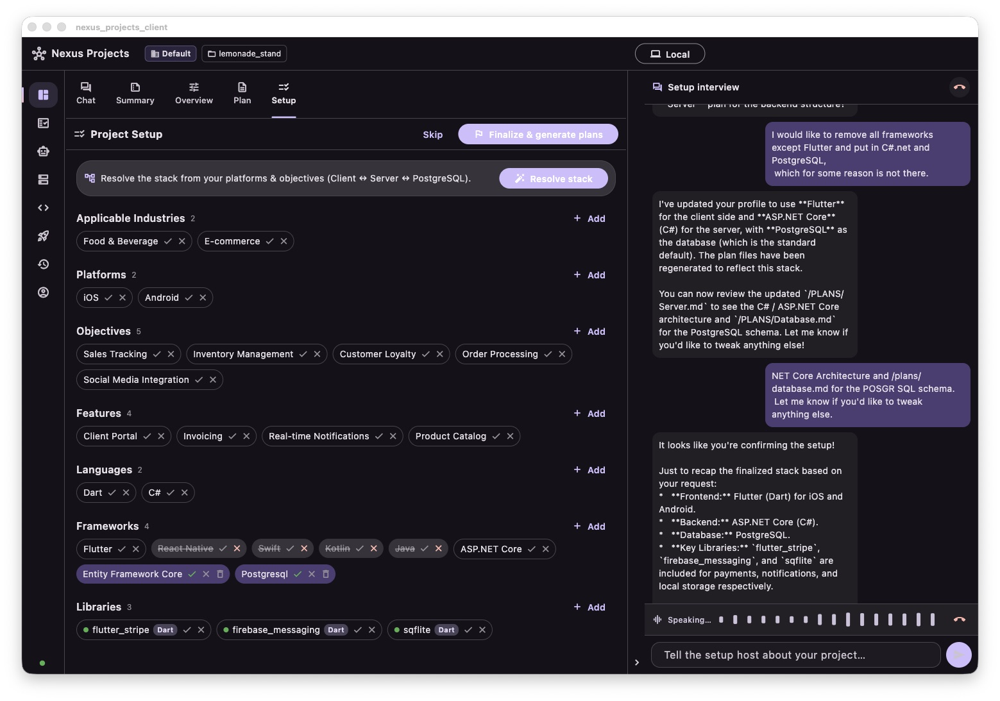

#### Living plans
Generated plans are living Markdown documents (Overview, Client, Server, Database) that every layer shares as project-wide context. Choose the Coordinator agent that owns each plan.

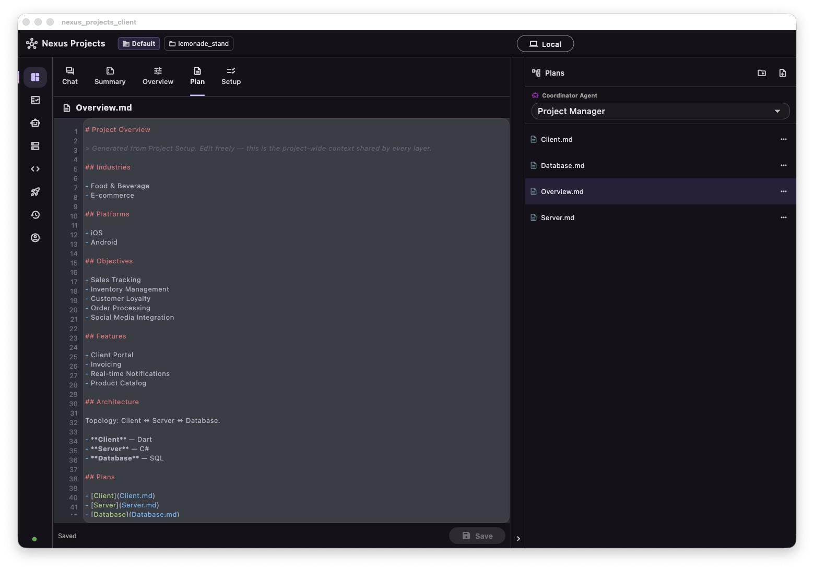

#### Hierarchical tasks with a rich detail panel
Each task has Overview, Sub-Tasks, Git Changes, Agent Work, and Builds & CI tabs. Status, priority, dates, and assigned agent persist live.

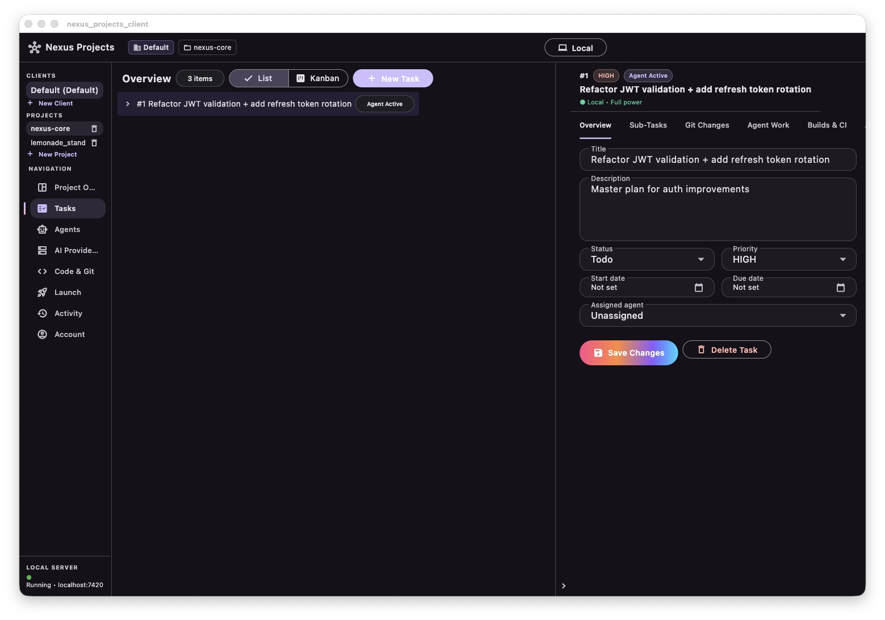

#### Agents & personas
A roster of specialized agent personas — Project Manager, Coordinator, and SDE specialists (Generalist, Networking, Physics, Database, UI/UX, DevOps) plus a Verification agent — each backed by a configurable model.

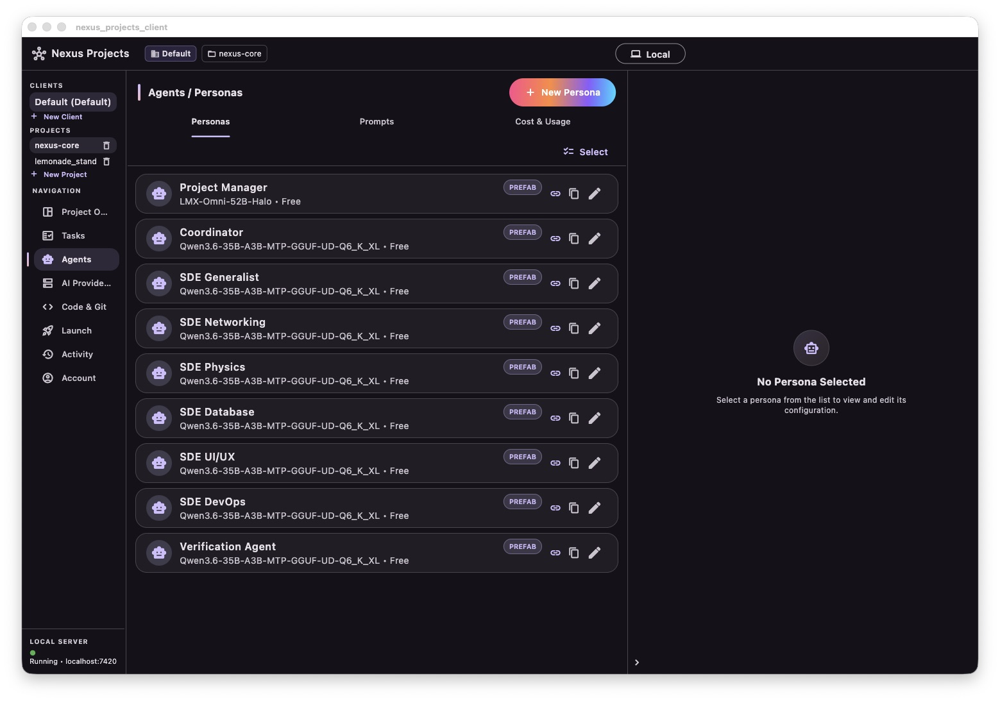

#### Bring your own inference
Automatic LAN discovery of Lemonade inference servers alongside your configured providers — pick the model that runs each agent.

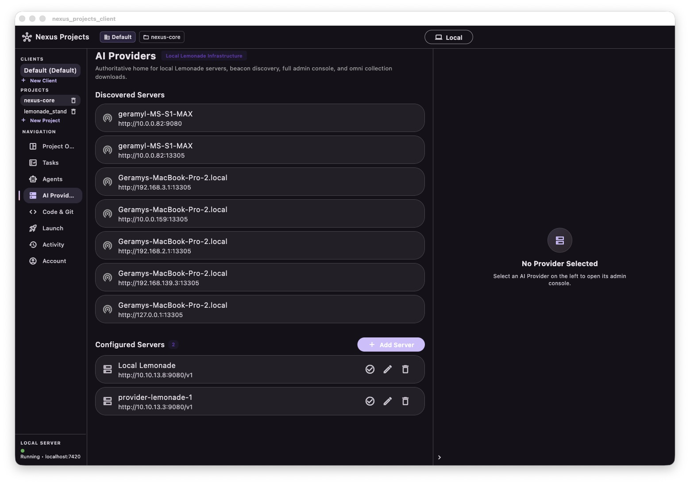

#### Code & Git, in app
An integrated workspace with Git — commit, push, pull, merge, branch, and history — plus an editor and source-control view over your project's plans and code.

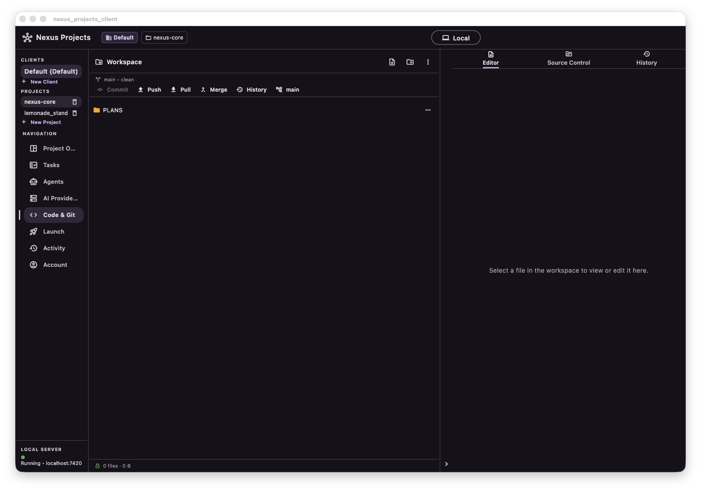

#### Build & package from the app
Docker-backed build environments, images, and containers with live build logs.

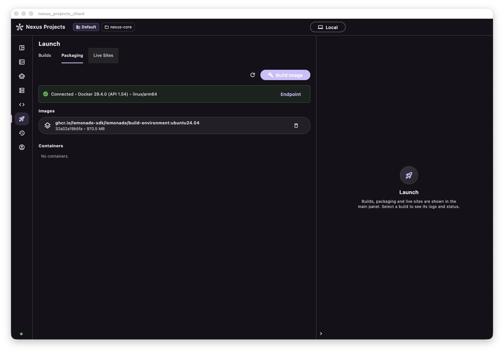

#### Account, usage & subscription
Usage is metered against your plan for the billing period; going over quota **paces** output instead of hard-failing. Plans run from Basic to Platinum with optional add-ons.

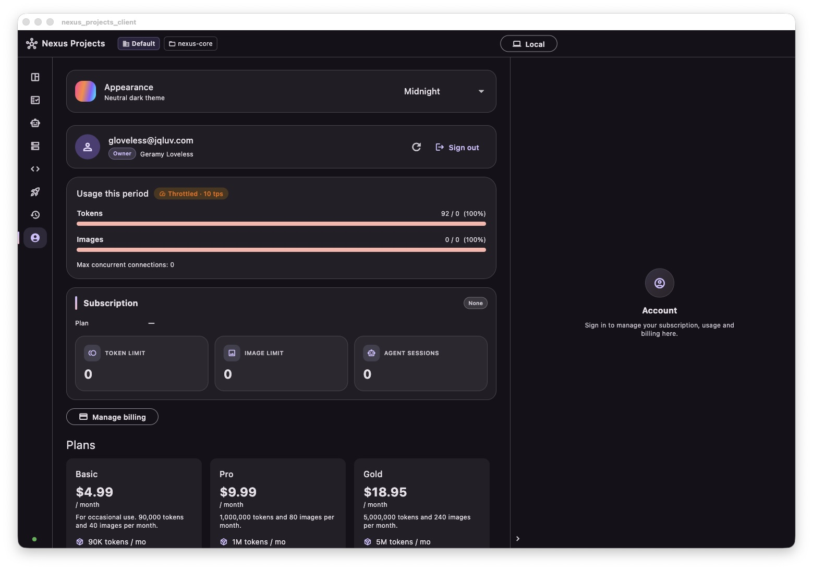
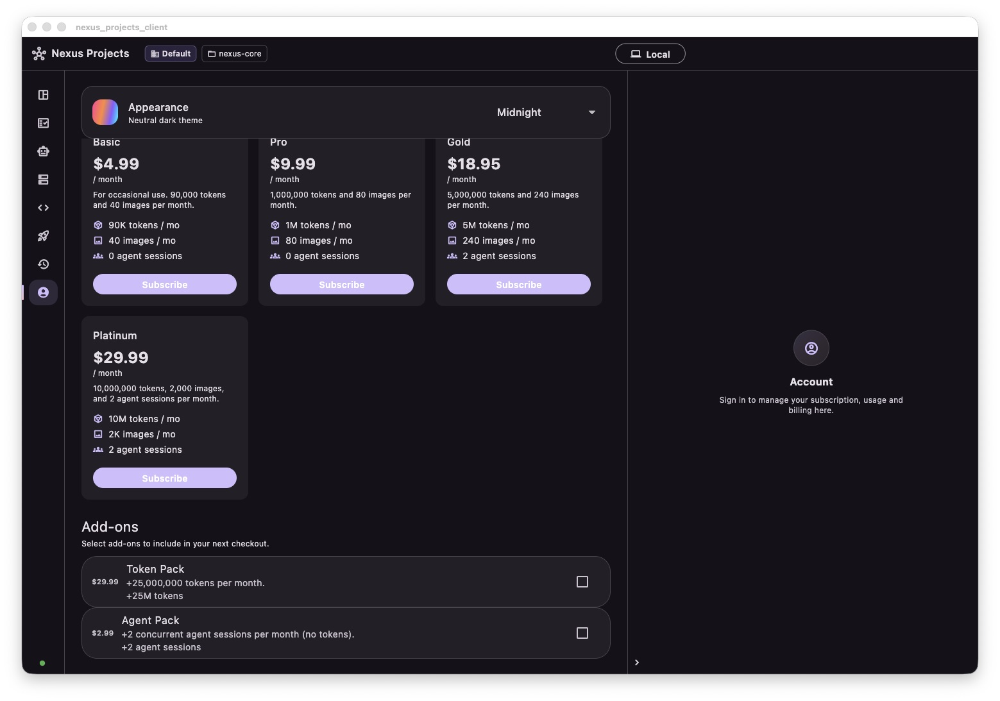

## Project Structure

```
nexus_projects_client/
├── lib/
│   ├── features/
│   │   ├── projects/          # Coordinator chat + session (core voice work)
│   │   ├── project_plans/
│   │   ├── tasks/
│   │   └── ...
│   ├── infrastructure/
│   │   ├── inference/         # InferenceClient (chat, tools, image, audio)
│   │   ├── database/
│   │   └── models/
│   └── services/audio/        # AEC, VAD, recorder, TTS
├── packaging/                 # Windows Inno Setup installer script
├── .github/workflows/         # CI + desktop build + release pipelines
└── README.md
```

## Getting Started

```bash
flutter pub get
dart run build_runner build --delete-conflicting-outputs
flutter run -d macos   # or your preferred device
```

### Voice / Microphone

On first use you will be prompted for microphone permission. The app uses proper voice communication audio modes for echo cancellation when talking to the Coordinator.

## Technology

- Flutter + Riverpod + Freezed + Drift (reactive SQLite)
- GoRouter
- Dio (with full streaming + tool call assembly)
- `record` + `just_audio` + `audio_session` + `vad` (for high-quality voice)

## Contributing / Philosophy

We follow extremely strict organization rules:
- One class per file
- Clear separation between database models and UI models
- All new major features (especially anything touching the Coordinator) must live in their own well-named files under `features/` or `services/`

## License & Usage

The Nexus Projects Client is **source-available** under the Sustainable Use License with Additional Use
Restrictions — see [`LICENSE.md`](LICENSE.md) for the full terms. It is source-available, not OSI "open
source." The following restrictions are central:

- **The subscription system on the Client may not be modified or replaced — at all.** You may not alter,
  reconfigure, bypass, or substitute your own subscription, billing, entitlement, or metering logic, and you
  may not point the Client at any inference/billing gateway other than the official **Nexus Router**.
- **The only permitted alternative is to remove the subscription system entirely** — i.e. ship a build that
  contains no subscription, billing, or entitlement functionality whatsoever. There is no middle ground:
  either keep the official subscription system and Router unchanged, or have none of it. Building your own in
  its place is not allowed.
- The **login / registration (authentication)** system likewise may not be modified to authenticate against
  any service other than the official Nexus services.

### Commercial use of the Router / subscription system

If you want to use the Nexus Router or its subscription/billing routing **commercially**, that is available
under a separate commercial license — please get in touch at **support@nexus-projects.ai** to arrange it.

**Organization exceptions:** **Lemonade-sdk** is permitted to use the Router through an existing partnership.
No other organization has this exception except by separate written agreement.

---

Built iteratively with a strong focus on real agentic workflows and natural voice interaction with your project's "main brain".
